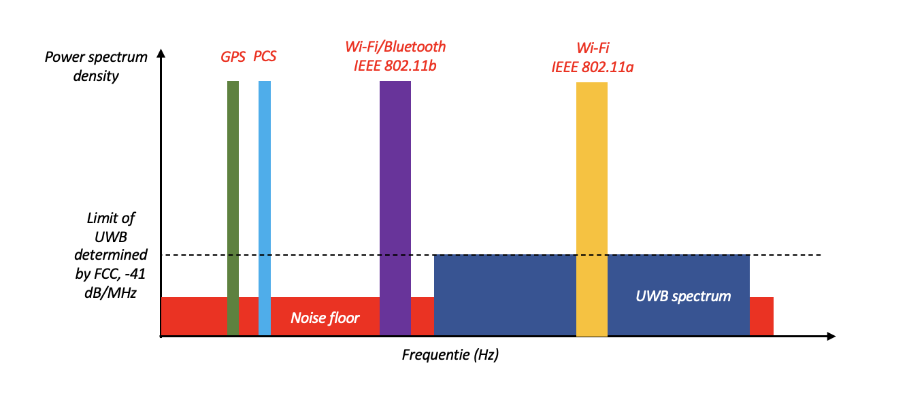

# Internet & Wireless

## Onderzoeksvraag

Wat is de toepassing van Ultra-Wideband (UWB) in toekomstige technologieën?

## Taakverdeling

| Vraag                                                                                        | Wie?   |
|----------------------------------------------------------------------------------------------|--------|
| D1. Van welke frequentie/bandbreedte maakt Ultra-Wideband gebruik?                           | Bob    |
| D2. Waarom heet het eigenlijk Ultra-Wideband? Welke verschillen heeft het?                   | Camiel |
| D3. Welke toepassingen gebruiken al Ultra-Wideband?                                          | Camiel |
| D4. Hoe kan Ultra-Wideband betreft techniek zich in de toekomst ontwikkelen?                 | Bob    |
| D5. Wat is het verschil tussen Ultra-Wideband en bijvoorbeeld 4G en 5G betreft zend theorie. | Samen  |
| H1. Wat is de toepassing van Ultra-Wideband in toekomstige technologieën?                    | Samen  |

## Deelvragen

### 1. Van welke frequentie/bandbreedte maakt Ultra-Wideband gebruik?

Met behulp van Ultra-Wideband kan een grote hoeveelheid gegevens worden verzonden. Dit is mogelijk door kleine gegevenspakketjes te zenden over een brede frequentieband. Doordat er sprake is van brede frequentiebanden kunnen de gegevenspakketten parallel worden verzonden. Er dan zelfs een maximale data overdracht mogelijk van één gigabyte over tien meter.

UWB werkt met kortdurende pulsen (dit kan een miljardste van een seconde bedragen). Daardoor kan er al gebruik worden gemaakt van bestaande frequenties die al voor andere toepassingen worden gebruikt. De tijdsduur van een puls is vaak zelfs zo kort dat er hierbij geen interferentie op kan treden. Toch zijn er vanwege bezorgdheden over interferenties regels gekoppeld aan UWB door de 'Federal Communications Commission' (FCC). Deze commissie laat UWB alleen toe als het met een zeer laag vermogen wordt gebruikt binnen toepassingen. Dit zorgt ervoor dat het bereik van UWB vaak alleen tientallen meters kan bedragen. Indien het bereik vergroot moet worden zal het vermogen van UWB respectievelijk vergroot moeten worden. 

Op een gegeven moment wilde de FCC de regels voor UWB versoepelen. Dit werkt echter tegengehouden door grote bedrijven die bepaalde frequentiebanden hadden opgekocht. In feite kan UWB opereren bijhorende een frequentie tussen de 3.1 en 10.6 GHz. Echter heeft het tegenwoordig haar toepassingen gevonden rond de 1 GHz (dezelfde frequentie als [GPS](https://nl.wikipedia.org/wiki/Global_positioning_system)), en de [GPR](https://nl.wikipedia.org/wiki/Ground-penetrating_radar). De frequentie varieert hierbij tussen de 3.1 en 10.6 GHz, zoals hierboven al eenmaal benoemd. Er is nog geen exacte frequentieband gegeven dat speciaal voor UWB wordt gebruikt, alhoewel worden hier recentelijk ontwikkelingen in gemaakt binnen IEEE 802.15.4Z.

UWB werkt met een spread-sprectrum technologie. Hierbij wordt een singaal met opzet verspreid over een bepaald frequentiedomein. Deze dergelijke signalen hebben een veel grotere bandbreedte dan de werkelijke informatie dat ze bevatten. Dit betekent dat er een ruisachtig signaal ontstaat, wat moeilijk te detecteren of te onderscheppen is. Verder wordt het ook moeilijk om een spread-spectrum signaal te storen met andere signalen. Vaak vraagt men zich af hoe een ontvanger een signaal kan decoderen dat veelal ruis zal bevatten. Om dit ruis eruit te filteren wordt er gebruik gemaakt van _spreading-codes_. Dit zijn codes die vrij willekeurig moeten zijn, maar toch moet de informatie bekend zijn bij zowel de zender als ontvanger van het UWB-signaal.Hieirn zijn twee factoren te definiëren, de eerste is FHSS. Het informatiesignaal springt van de ene frequentieband naar de andere. De volgorde hiervan wordt bepaald door de _spreading-codes_. De tweede is daarentegen DSSS. De informatie wordt in bits verzonden, en de _spreading-code_ werkt met een hogere frequentie. Het is mogelijk om deze twee toepassingen met elkaar te combineren.

In de onderstaande afbeelding wordt deze theorie mooi gevisualiseerd. Je kunt zien dat UWB een groot frequentiebereik heeft. Het varieert inderdaad van ongeveer 3.1 tot 10.6 GHz. Verder is ook zichtbaar dat de FCC een limiet heeft gesteld aan het vermogen dat UWB zoal uit mag zenden. Merk op dat dit voor 802.11a (een 5 GHz Wi-Fi verbinding) veel groter is. Doordat UWB zo'n groot frequentiespectrum kunnen veel gegevens worden verzonden, maar een verminderd zendvermogen van dit medium kan het echter maar enkele meters reiken.

  
  
Figuur 1: Overzicht spectra verschillende wireless protocollen

Het is zichtbaar dat het bereik van UWB dicht bij het 'noise level' ligt. Soms vraagt men zich hierbij af of het 'noise level' niet kan storen met het vermogen dat UWB zoal gebruikt. Dit vormt geen probleem, aangezien UWB gebruik maakt van spread-spectrum technologie. Deze technologie is hierboven al uitgewerkt, en zorgt ervoor dat het signaal met opzet over een breed frequentiebereik wordt verstuurd. Op basis van de data dat binnen een signaal wordt verstuurd maakt het dus niet uit dat het vermogen van UWB dicht bij het 'noise level' ligt. 

### 2. Waarom heet het eigenlijk Ultra-Wideband? Welke verschillen heeft het?

In figuur 1 is het bereik en domein van de verschillende protocollen goed te vergelijken. Hieruit blijkt ook dat de bekendere protocollen die worden weergeven in dit figuur een (stuk) band gebruiken voor de communicatie. Bij het bekijken van het UWB spectrum wordt het al snel duidelijk dat er een paar verschillen zijn tussen "standaard" protocollen zoals GPS, Wi-Fi of Bluetooth en UWB. Uit het figuur is het voornaamste verschil duidelijk het verschil in breedte van de frequentie band. Bij GPS of Wi-Fi wordt er een vrij smal bereik gebruikt voor het versturen van data, terwijl bij UWB dit bereik een stuk groter is. 

Het verschil in bereik is zo groot dat de oudere UWB standaard een spectrum heeft die de veelgebruikte Wi-Fi standaarden (802.11a/n/g/ac/ax) overlapt. Tegenwoordig kan UWB zelfs gebruik maken van sub 1 GHz frequenties. De huidige UWB standaard zou dus zelfs de frequentie van GPS (1.176 tot 1.57542 GHz) kunnen overlappen. Men zou kunnen verwachten dat deze overlapping van UWB op zoveel andere bandbreedtes, gebruikt door andere connectiviteit protocollen, interferentie zou veroorzaken. Verder zou er ook kunnen worden verwacht dat het gebruik van UWB in combinatie met andere connectiviteit, er voor zou zorgen dat er slechte data overdracht mogelijk is door interferentie. 

Mogelijke interferentie die kan worden veroorzaakt door het gebruik van een al bepaalde frequentie bereik (zoals bij GPS) klinkt alarmerend. Dit is in de realiteit niet zo, omdat het power spectrum van UWB dus een stuk lager ligt dan de protocollen die een beperkter of smaller bereik hebben dan UWB. Zo is interferentie eigenlijk geen probleem, vanwege het lage vermogen van UWB op overlappende frequentie banden.

### 3. Welke toepassingen gebruiken al Ultra-Wideband?

Vanwege het lage stroom verbruik door het lagere zendvermogen is UWB erg handig voor real-time locatie systemen zonder interferentie te veroorzaken. Huidige toepassingen van UWB zijn al te vinden in verschillende (draagbare) persoonlijke elektronika zoals telefoons, smart horloges of bij het opsporen van spullen. Apple maakt bijvoorbeeld gebruik van UWB technologie in hun U1 (**U**ltra-Wideband 1) chip. Deze chip communiceert met de Apple AirTag, een kleine tracker de grote van een chocolade munt, en andere communicatie tussen andere apparaten van Apple, zoals de HomePod. 

Ook andere bedrijven zoals Microchip, implementeren UWB voor het gebruik van real-time tracking, radar en data overbracht. Er was ook een voorstel voor het gebruik van UWB in personal area netwerken, dit voorstel is niet aangenomen. UWB is gebruikt voor "see-through-the-wall" systemen om mensen te kunnen detecteren door muren heen.

### 4. Hoe kan Ultra-Wideband betreft techniek zich in de toekomst ontwikkelen?

UWB heeft steeds meer toepassingen. Dit komt er onder andere mede door dat Apple in haar nieuwste producten met deze technologie voorziet. Het wordt voornamelijk gebruik om precies locaties te bepalen, en bijvoorbeeld objecten tot een exacte afstand te kunnen vinden. Maar tegenwoordig vindt het ook steeds meer haar toepassingen in bijvoorbeeld de zorg en autotechniek. Deze toepassingen zullen zich in de nabije toekomst daarom steeds verder gaan ontwikkelen, en UWB zal een groter aandeel hebben in de technologie dat wordt gebruikt in het dagelijks leven. Hieronder volgt een verdere opsomming:

- Social distancing. Ten tijde dat de corona-pandemie op zijn toppunt was werd UWB gebruikt om afstanden te bepalen, om zo eventuele besmettingen tussen personen op te kunnen sporen. Doordat afstanden tot tien centimeter nauwkeurig kunnen worden gemeten kan een verspreiding in sommige gevallen worden voorkomen, of worden opgespoord. De reden dat UWB hier onder andere ook voor wordt gebruikt is dat het een zeer laag stroomverbruik heeft, ideaal voor mobiele apparaten. In de toekomst zal UWB er dus voor kunnen worden gebruikt om verspreidingen van virussen op te sporen.
- Industrie. Gereedschappen (zoals bijvoorbeeld momentsleutels) in productieprocessen kunnen op afstand worden gekalibreerd met behulp van UWB. Eventuele fouten in gereedschappen kunnen direct en snel worden opgelost, en de productie kan efficiënter worden verricht. In de toekomst zal UWB verdere toepassingen krijgen in bijvoorbeeld de verf industrie. Er kan middels dit medium zeer nauwkeurig de afstand worden bepaald tussen een spuitkop en een oppervlak dat wordt gespoten. Zo worden oneffenheden in een verf proces volledig geëlimineerd. 
- Er worden zeer recentelijk stappen gezet in de ontwikkeling van UWB Secure Payment, om de volgende stap van beveiligd betalen te zetten. De opname van Scrambled Timestamp Sequence (STS) in IEEE 802.15.4Z helpt ervoor te zorgen dat kritieke informatie, zoals de validatieafstand tot de betaalterminal veilig wordt bewaard en niet kan worden onderschept of gemanipuleerd. Contactloos betalen kan met UWB dus veiliger worden gemaakt.
- Auto's, contactloos de auto binnentreden. Veelal nieuwe auto's worden voorzien van een technologie waar men de auto kan betreden, zonder hier bijvoorbeeld fysiek de sleutel voor te hoeven gebruiken. Echter, doordat je hier niet de sleutel fysiek voor hoeft te gebruiken bestaat er een kans voor dieven de auto gemakkelijker te kunnen stelen. Maar als autosleutels voorzien worden van UWB kan dit worden gebruikt om te kijken of de drager van de sleutel daadwerkelijk in de buurt is van de auto om deze te openen, en zich in de auto bevindt om deze te starten. Met behulp van IEEE 802.15.4Z met Scrambled Timestamp Sequence (STS) zal het zelfs mogelijk worden om communicatie tussen een sleutel en auto volledig te beveiligen, zonder dat hacken mogelijk is. 

### 5. Wat is het verschil tussen Ultra-Wideband en bijvoorbeeld 4G en 5G betreft zend theorie.

## Hoofdvraag: Wat is de toepassing van Ultra-Wideband in toekomstige technologieën?

Huidige toepassingen van UWB zijn al te vinden in tracking apparaten van Apple vanwege de hoge precisie en laag energieverbruik over korte afstand. 

Brainstorm:
* Zeggen verdere uitbreiding veilig betalen.
* Vergelijking met Wi-Fi 7.
* COVID detectie.
* Optimalisatie bedrijfsprocessen.
* Auto's autonoom rijden.
* Landbouw.

# Afkortingen

Hieronder is een opsomming gegeven van enkele gebruikte afkortingen in dit vooronderzoek:

* FCC, Federal Communications Commission.
* UWB, Ultra-Wideband.
* FHSS, Frequency Hopping Spread Spectrum.
* DSSS, Direct Sequence Spread Spectrum.

## Referenties

Hieronder is een opsomming gegeven van de referenties gebruikt in dit vooronderzoek.

* Wikipedia. (2021, 21 april). Ultra-wideband. Geraadpleegd op 3 mei 2022, van https://nl.wikipedia.org/wiki/Ultra-wideband
* ScienceDirect. (2021, 23 februari). Ultra-Wideband. Geraadpleegd op 3 mei 2022, van https://www.sciencedirect.com/topics/engineering/ultra-wideband
* UWB Alliance. (2020, 26 januari). UWB Allicance. Geraadpleegd op 3 mei 2022, van https://uwballiance.org
* IEEE SA. (2020, 15 mei). IEEE SA - IEEE 802.15.4z-2020. IEEE. Geraadpleegd op 3 mei 2022, van https://standards.ieee.org/ieee/802.15.4z/10230/
* Qorvo US Inc. (2020, Mei). Getting Back to Basics with
Ultra-Wideband (UWB). Geraadpleegd op 12 Mei 2022, van https://www.qorvo.com/-/media/files/qorvopublic/white-papers/qorvo-getting-back-to-basics-with-ultra-wideband-uwb-white-paper.pdf
* IEEE SA. (2022, 4 januari). Tracking Resurgence of Ultra-Wideband - A Standards and Certification Perspective. IEEE Conference Publication | IEEE Xplore. Geraadpleegd op 12 mei 2022, van https://ieeexplore.ieee.org/document/9668524?arnumber=9668524
* IEEE SA. (2021, 9 oktober). "Ultra-Wideband Flexible and Wearable Textile Antenna for Predicting Breast Cancer." IEEE Conference Publication | IEEE Xplore. Geraadpleegd op 12 mei 2022, van https://ieeexplore.ieee.org/document/9588797?arnumber=9588797
    > Bron voor verder onderzoek naar toepassing van UWB in de toekomst. 
* E. M. Shaheen and M. El-Tanany (2010), "The impact of narrowband interference on the performance of UWB systems in the IEEE802.15.3a channel models." Geraadpleegd op 21 Mei 2022, van https://ieeexplore.ieee.org/document/5575235/

***Opmerking:*** voor het zoeken naar referenties is er gebruik gemaakt van de wetenschappelijke artikelen dat de Saxion bibliotheek hiervoor heeft.
Om hier meer gegevens over te verkrijgen, raadpleeg Blackboard, en dan de library pagina.

***Overige informatie:***
> Voor referenties, gebruik een APA-vermelding. Dit is eenvoudig te genereren via de volgende [link](https://www.scribbr.nl/bronnengenerator/apa/).

## Feedback van andere groepen

### From Julia Aalbers:

Hello Bob and Camiel,

Here is the feedback regarding your presentation on: Ultra-Wideband: "what is the application in future technologies?"

#### content of presentation:

Clear explanation, a lot of information conveyed in a clear and well-arranged way. However, there could be made a more/better distinction in which information can be told and which cannot. Due to the large amount of information it remains difficult to follow the presentation. For example, think of all ISO standards, comparisons and so on. This can weaken the actual information you wish to convey by making it difficult to follow through after all this information. The subject has therefore been discussed quite broadly in relation to the research question. 

#### use of slides: 

Good use has been made of graphs in the slides (frequency spectrum), and the slides are very readable given the contrast white text on a dark background.  

The overview slides are a nice addition to the previous slides with a lot of text and give a nice ‘summary’ of the extensive information previous provided (for example, slide number 12). The many text, numbers and abbreviations sometimes make it a bit difficult to get a quick overview of what may be said in terms of information during that slide. 

#### presentation skill: 

Clear voice. Much of the information presented was already in full sentences on the slides. Which gives you a choice whether to listen or read the slides. 

The overall subjective opinion: good.  

DOEI!!!

### Wybren van den Akker

#### Content Of Presentation
Is the topic covered deep or broad enough, is there a good line between research question(s) and conclusions/recommendations?

Overall we thought the presentation’s content was pretty good. The fact you immediately stated your research question at the start of the presentation was very nice because it allowed for us to put the information you were giving into context.
We found that you went very in depth on the technical specifications on UWB, and especially the slides with pictures comparing it to other products such as WiFI were very interesting. However we felt that you skipped over the usage of UWB a bit, such as how data is actually transmitted. You talked about how its used to determine distance, but in the case of replacing NFC for payments, etc. not much was said about how the devices would identify themselves.
We also liked that you mentioned the current state of the technology not just in who uses it but also what the community surrounding it is working on right now. 

Lastly, we felt that the conclusions were well in line with the research question, although mostly personal and not backed up by sources from the industry, etc. Perhaps (if applicable) you could have mentioned that some car manufacturers have started researching UWB as a replacement for NFC in keyless access. The fact that you had different conclusions for each presenter was nice and gave the presentation a nice personal touch.

#### Use Of Slides
Balance between text and pictures, structure and layout, page numbers
We felt that the slides were predominantly text based and few of them had pictures. It would be better to use less text and more pictures, or if no pictures are available at least use less text. It sometimes distracted from your presenting when lots of text needed to be read. The choice of color was very nice though since the white letters on black background made it easy to read.

We really liked the layout of your (overview) slide 12. It was easy to read and clearly communicated what you were talking about. It would have been nice if this format was applied to more of the presentation.

Perhaps you could have ordered the ending of the presentation a little bit differently as it seemed that you jumped back and forth between some pretty similar topics, which felt a bit repetitive. 

#### Presentation Skill
Clear and calm voice, good explanation, does it “add” to the topic/slides?
First of all, both of you seemed like you knew what you were talking about. The information was clearly presented and explained. However you sometimes mumbled a little bit or were checking information on the slides, which resulted in you speaking in the direction of the screen instead of the room. The size of the room then made it a little hard to hear you in these cases.
I really liked that you had a little practical showcase of the apple airtag. It was a nice break from the usual presentation format.
You alternated well between the two speakers. You both seemed to have an equal section of the presentation and neither speaker was quiet for too long.

#### Subjective Opinion (Grade)

Aside from some issues with the slides being predominantly text based and what we personally felt as some lacking depth in how data is communicated over UWB, everything was perfect. We give this a good rating.
